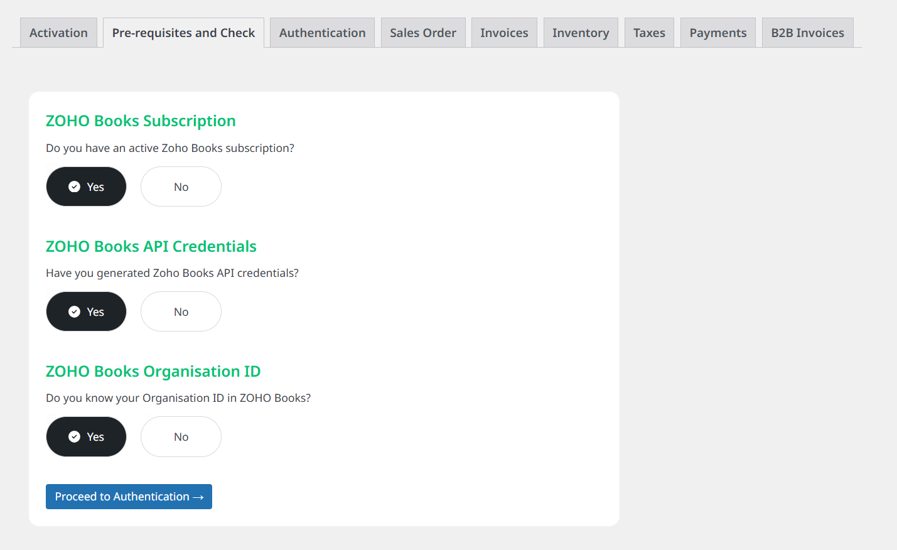

1. The checks and prerequisites screens looks like below

2. This screen helps you determine if you have everything in place to connect LinkZoho to your Zoho Books account
3. You need 3 things
    - An active ZohoBooks or ZohoOne subscription 
    - A Zoho Client having ZohoBooks API credentials (read Zoho API Client Credential point)
    - And your ZohoBooks Organization ID