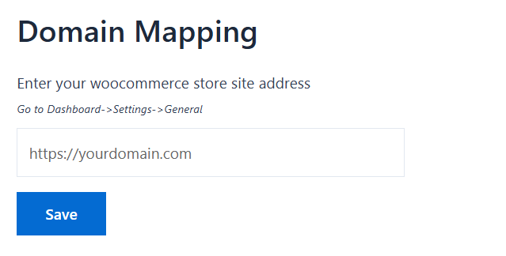
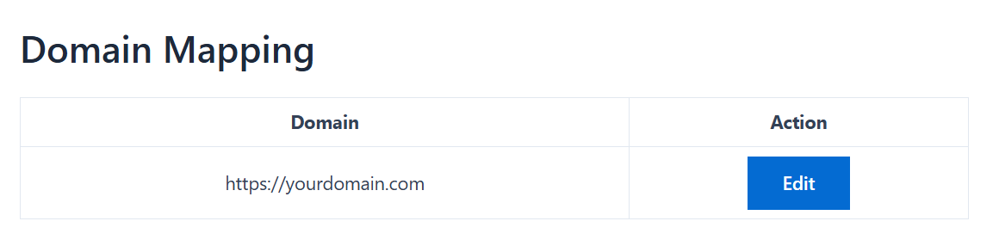

# **LinkZoho- Installation, Activation and Setup Doc**

Congratulations on purchasing LinkZoho subscription. Now your invoices will have the power of AI and will be generated 100% automatically.

Follow the instructions below to install, activate and set up LinkZoho for your ecommerce store.

## **Password Reset**
1. Once you purchase, you will be logged in automatically into your dashboard
2. We recommend that you logout and reset your account password to your choice for easy access
3. Link to reset password- https://app.linkzoho.com/my-account/lost-password/

## **LZ License key & Domain Mapping**
To use LinkZoho on your store you will need your exclusive license key and map your domain. Follow the steps below to access

1. Log into your account
2. Go to orders
3. Click the button ‘Add domain’ in front of your successful order. Order status should be ‘processing’ or ‘completed’
4. You will see your license key, don’t share this key with anyone. You will need this key on the activation stage.
5. In the domain mapping box, enter the full homepage url of your store. If your store is on a subdomain or a subdirectory then enter the url with full subdomain or subdirectory, look at the image below, don't forget to press save.

6. 
7. After saving it should look like the above image, if you entered a wrong url, press edit and map again.

