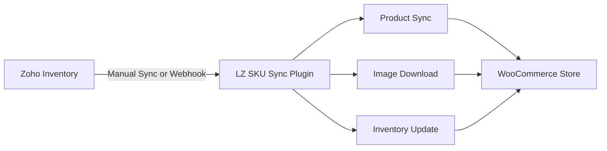

# LZ SKU Sync - Overview

**Automate Product Synchronization Between Zoho Inventory and WooCommerce**

---

## What is LZ SKU Sync?

**LZ SKU Sync** is a premium WordPress plugin that eliminates manual product data entry by automatically synchronizing products, inventory levels, images, and attributes between **Zoho Inventory** and **WooCommerce**. Whether you're managing a few products or thousands, LZ SKU Sync ensures your online store always reflects accurate, up-to-date information from Zoho.

---

## Key Benefits

### 🚀 **Save Time**
Stop manually updating product information in WooCommerce. LZ SKU Sync automates the entire process, giving you more time to focus on growing your business.

### ✅ **Prevent Errors**
Eliminate data entry mistakes and inventory discrepancies with automated synchronization that always uses Zoho Inventory as the source of truth.

### 📊 **Real-Time Updates**
With webhook integration, changes in Zoho Inventory appear in your WooCommerce store within seconds.

### 🖼️ **Automatic Image Management**
Product images are downloaded and organized automatically with standard WordPress thumbnail generation.

### 📦 **Multi-Warehouse Support**
Sync inventory from specific warehouses in your Zoho account, perfect for businesses with multiple locations.

---

## Core Features

### **Dual Synchronization Modes**
- **Manual Sync**: One-click bulk synchronization for initial setup or occasional updates
- **Real-Time Webhook Sync**: Automatic synchronization when products change in Zoho Inventory

### **Complete Product Support**
- ✅ Simple products with full product details
- ✅ Variable products with attributes and variations
- ✅ Product images (featured and gallery)
- ✅ SKU-based matching for accurate updates

### **Rich Product Data**
Sync all essential product information:

- Product name and description
- SKU and pricing
- Stock quantities and status
- Weight and dimensions (with unit conversion)
- Low stock thresholds
- Product images

### **Advanced Image Features**
- Automatic image download from Zoho
- Standard WordPress thumbnail generation
- Duplicate prevention using MD5 hashing
- Gallery management for variable products
- Background processing to prevent timeouts

### **Intelligent Inventory Management**
- Multi-warehouse support
- Real-time stock updates
- Stock status management (In Stock/Out of Stock)
- Low stock notifications
- Inventory overview dashboard

### **Granular Control**
- Choose whether to create new products or only update existing ones
- Control product status (Draft, Pending, or Published)
- Enable/disable for new variation products
- Separate controls for simple products and variations

---

## What Problems Does It Solve?

| Problem | Solution |
|---------|----------|
| **Manual Data Entry** | Automates product synchronization with one-click or real-time updates |
| **Inventory Inaccuracies** | Keeps stock levels synchronized to prevent overselling |
| **Time-Consuming Updates** | Batch processing handles hundreds of products automatically |
| **Image Management** | Downloads and optimizes images automatically |
| **Product Variations** | Automatically creates WooCommerce attributes from Zoho variations |
| **Multiple Warehouses** | Sync from specific warehouse locations |

---

## System Requirements

### WordPress Environment
- WordPress 4.7 or higher
- PHP 7.4 or higher (8.0+ recommended)
- WooCommerce 7.9 or higher
- MySQL 5.6 or higher

<!-- ### Required PHP Extensions
- cURL (API communications)
- JSON (data handling)
- ZIP (image extraction)
- GD or Imagick (image processing)
- OpenSSL (encryption) -->

### Zoho Requirements
- Active Zoho Inventory account
- API access enabled (included in all plans)
- Organization with products and items

---

## How It Works

1. **Connect**: Authenticate with Zoho Inventory
2. **Configure**: Select warehouse and sync preferences
3. **Sync**: Choose manual or automatic webhook sync
4. **Monitor**: Track sync progress and view logs
5. **Automate**: Enjoy real-time product updates

---

## Getting Started

Ready to automate your product management? Follow these steps:

1. [**Install & Activate**](installation.md) - Upload the plugin and activate your license
2. [**Initial Setup**](initial-setup.md) - Connect to Zoho Inventory and configure settings
3. [**Choose Sync Method**](sync-methods.md) - Select manual or webhook synchronization
4. [**Configure Settings**](product-settings.md) - Customize what data to sync

---

## Support

Need help getting started?

- 📧 Email: sales@linkzoho.com, support@krenovate.com
- 🌐 Website: [https://linkzoho.com](https://linkzoho.com)
- 📖 Documentation: [https://docs.linkzoho.com/lz-sku-sync/](https://docs.linkzoho.com/lz-sku-sync/)

---

*Ready to get started? [Install LZ SKU Sync →](installation.md)*
