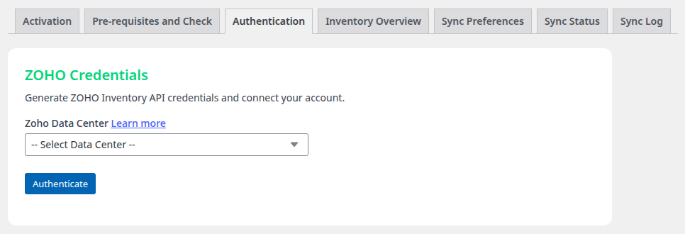
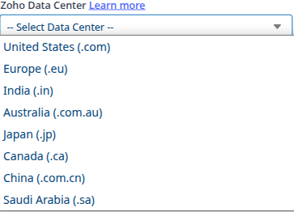
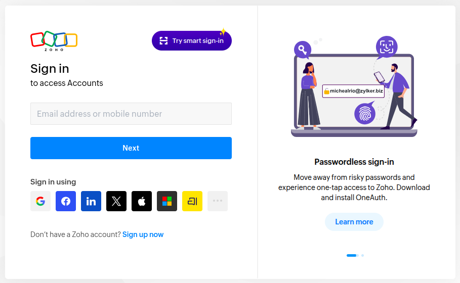
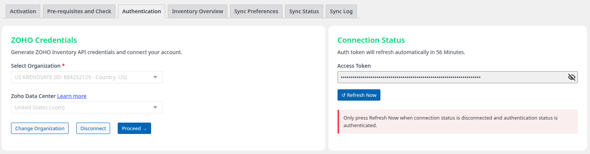
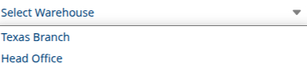

# Initial Setup & Configuration

After installing and activating LZ SKU Sync, follow these steps to connect your WordPress site to Zoho Inventory.

---

## Authentication with Zoho Inventory

LZ SKU Sync uses OAuth 2.0 to securely connect with your Zoho Inventory account through the LinkZoho OAuth Bridge.

---

## Step 1: Navigate to Authentication Settings

1. In WordPress admin, go to **LZ SKU Sync > Settings**
2. Click the **Authentication** tab
3. You'll see the connection interface

---

## Step 2: Select Your Datacenter

1. Click the **Authentication Tab** button
2. Select your **Zoho Datacenter** from the dropdown (e.g., .com, .in, .eu, .com.au, .jp)
3. Click **Authenticate**

!!! note
    **What is a Datacenter?**  
    Zoho operates servers in multiple regions. Select the datacenter where your Zoho account is registered (usually matches your country/region).

---

## Step 3: Login to Zoho (If Needed)

1. You'll be redirected to **Zoho Accounts** login page
2. If you're already logged in to Zoho, this step will be skipped automatically
3. If not logged in, enter your Zoho credentials and click **Sign In**

---

## Step 4: Authorize LZ SKU Sync

After logging in, you'll see the **Zoho OAuth consent screen**:

1. Review the permissions being requested
2. **Check the checkbox**: "I allow LZ Server Based OAuth to access the above data from my Zoho account..."
3. Click **Accept** to grant permissions

### Required Permissions

LZ SKU Sync requests the following Zoho Inventory permissions:

- ✅ To manage all of your Zoho Inventory data

!!! important
    Without the permission, the plugin cannot sync your products.

---

## Step 5: Redirect to WordPress

After clicking Accept:

1. You'll be automatically redirected back to your WordPress site
2. The plugin will complete the authentication process
3. You'll land on the **LZ SKU Sync Authentication** page

## Step 6: Select Organization

If your Zoho account has **multiple organizations**, you'll need to select which one to sync from.

### Single Organization Users
- If you have only one organization, it will be automatically selected

### Multiple Organization Users

1. After authorization, you'll see a dropdown with all your organizations
2. Select the **organization** you want to sync products from
3. Click **Save Organization**

!!! tip
    **Using Multiple Organizations?**  
    You can only sync from one organization at a time. To switch organizations later, disconnect and reconnect with a different organization selected.

---

## Step 7: Verify Connection

After successful connection, you'll be redirected back to WordPress. You should see:

✅ **Authentication Status**: Connected  
✅ **Organization Name**: Your selected organization  
✅ **API Domain**: Your Zoho datacenter (e.g., .com, .in, .eu, .com.au, .jp)  
✅ **Token Expiry**: Next refresh time

### What Gets Stored

The plugin securely stores:

- **Access Token** - Auto-refreshed every 58 minutes
- **Refresh Token** - Used to get new access tokens
- **Organization ID** - Your selected organization
- **API Domain** - Zoho datacenter URL

!!! note
    **Security**: Access tokens are encrypted using AES-128-CBC encryption with HMAC SHA256 verification.

---

## Step 8: Select Warehouse

After authentication, configure which warehouse to sync inventory from.

1. Go to **LZ SKU Sync > Sync Status** tab
2. Find **Sync Preferences** section
3. Look for **Select Warehouse / Location to sync** dropdown
4. Select your warehouse/location from the list

!!! important
    **Multi-Warehouse Support**  
    LZ SKU Sync can sync from any warehouse in your Zoho Inventory, but only **one warehouse at a time**. Stock quantities and availability will reflect the selected warehouse.

---

## Understanding API Datacenters

Zoho operates servers in multiple regions. LZ SKU Sync automatically detects your datacenter:

| Datacenter | API Domain | Regions |
|------------|------------|---------|
| US | inventoryapi.zoho.com | United States |
| India | inventoryapi.zoho.in | India |
| Europe | inventoryapi.zoho.eu | Europe |
| Australia | inventoryapi.zoho.com.au | Australia |
| Japan | inventoryapi.zoho.jp | Japan |
| Canada | inventoryapi.zoho.ca | Canada |
| China | inventoryapi.zoho.com.cn | China |
| Saudi Arabia | inventoryapi.zoho.sa | Saudi Arabia |

!!! note
    The correct datacenter is automatically configured during authentication. You don't need to change this manually.

---

## Disconnecting from Zoho

To disconnect and reconnect with a different organization:

1. Go to **LZ SKU Sync > Settings > Authentication**
2. Click **Disconnect** button
3. Confirm the disconnection
4. Follow Steps 2-8 again to reconnect

!!! warning
    **Disconnecting Will:**

    - Delete stored access tokens
    - Stop webhook synchronization
    - Require re-authentication to sync again

---

## Next Steps

✅ Connected to Zoho Inventory  
✅ Organization selected  
✅ Warehouse configured  

**You're ready to start syncing!**

[**Choose Your Sync Method →**](sync-methods.md)

---

## Troubleshooting Authentication

### Connection Failed

**Problem:** "Failed to connect to Zoho" error

**Solution:**

- Check your internet connection
- Verify Zoho Inventory is accessible
- Try disconnecting and reconnecting
- Clear browser cache and try again

### Organization Not Appearing

**Problem:** Your organization doesn't show in the dropdown

**Solution:**

- Verify you have admin access to the organization in Zoho
- Check that the organization has Zoho Inventory enabled
- Try logging out of Zoho and reconnecting

### Token Refresh Failures

**Problem:** "Token expired" or "Authentication failed" errors

**Solution:**

- The plugin auto-refreshes tokens every 58 minutes
- If refresh fails, disconnect and reconnect
- Check that your Zoho account hasn't been suspended
- Verify API access is enabled in Zoho settings

### Wrong Datacenter Detected

**Problem:** API calls failing due to incorrect datacenter

**Solution:**

- The datacenter is detected from your Zoho account region
- Disconnect and reconnect to refresh datacenter detection
- Contact support if issue persists

---

## Support

Having trouble with authentication?

- 📧 Email: sales@linkzoho.com, support@krenovate.com
- Include error messages and screenshots if possible
