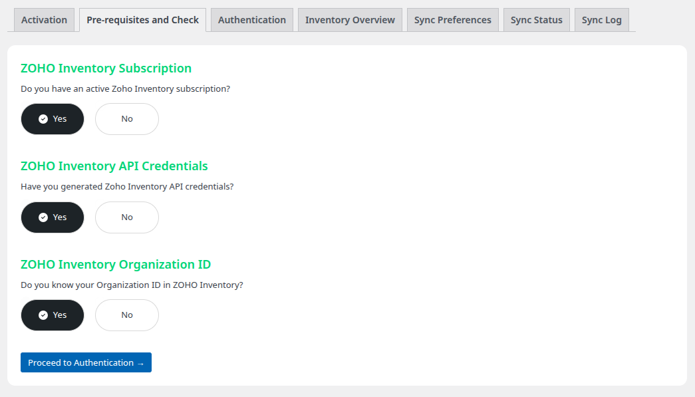

# Installation & Activation

This guide will walk you through installing and activating the LZ SKU Sync plugin on your WordPress site.

---

## Prerequisites

Before installing LZ SKU Sync, ensure you have:

✅ **WooCommerce Installed** - LZ SKU Sync requires WooCommerce to function  
✅ **WordPress Admin Access** - You'll need administrator privileges  
✅ **Plugin ZIP File** - Downloaded from your purchase  
✅ **License Key** - Received via email after purchase

---

## Step 1: Install WooCommerce

**LZ SKU Sync requires WooCommerce** to be installed and activated.

If WooCommerce is not already installed:

1. Go to **Plugins > Add New** in WordPress admin
2. Search for **"WooCommerce"**
3. Click **Install Now**
4. Click **Activate**
5. Complete the WooCommerce setup wizard (optional - you can skip this)

!!! note
    LZ SKU Sync will not activate if WooCommerce is not active on your site.

---

## Step 2: Upload LZ SKU Sync Plugin

1. Log in to your **WordPress admin panel**
2. Navigate to **Plugins > Add New**
3. Click **Upload Plugin** button at the top
4. Click **Choose File**
5. Select the `LZ-SKU-Sync.zip` file you downloaded
6. Click **Install Now**
7. Wait for the upload to complete

---

## Step 3: Activate the Plugin

1. After installation completes, click **Activate Plugin**
2. You'll be automatically redirected to the **LZ SKU Sync** settings page
3. You should see a new **"LZ SKU Sync"** menu item in your WordPress admin sidebar

{ height="200", width="200" }

---

## Step 4: Activate Your License

License activation is required to use the plugin and receive updates.

### Get Your License Information

Before activating:

1. Log into your account at [app.linkzoho.com](https://app.linkzoho.com)
2. Go to **Orders**
3. Find your LZ SKU Sync order
4. Click **View License** or similar button
5. Copy your **Order ID** and **License Key**

!!! important
    Keep your license key confidential. It's used for authentication and webhook security.

### Activate the License

1. You'll see the **License Activation** screen after plugin activation
2. Enter your **Order ID**
3. Enter your **License Key**
4. Click **Activate License**

### What Happens During Activation

The plugin connects to LinkZoho's servers to:

- ✅ Validate your purchase
- ✅ Enable automatic updates
- ✅ Activate plugin features
- ✅ Enable webhook functionality

### Activation Success

After successful activation, you'll see:

- ✅ Green success message
- 🔐 License status showing as "Active"
- 📅 License expiry date (if applicable)

---

## Step 5: Prerequisites Check

After license activation, the plugin will guide you through the prerequisites screen.

This screen helps you determine if you have everything in place to connect LZ SKU Sync to your Zoho Inventory account.

You need 3 things:

- An active Zoho Inventory or Zoho One subscription
- A Zoho Client with Zoho Inventory API credentials (read Initial Setup for details)
- Your Zoho Inventory Organization ID and Warehouse selection

---

## Step 6: Verify Installation

To confirm everything is working:

1. Check for the **LZ SKU Sync** menu in WordPress admin sidebar
2. Click **LZ SKU Sync > Settings**
3. You should see the settings page with multiple tabs:
      - Authentication
      - Sync Status
      - Product Settings
      - Inventory Overview

---

## Next Steps

✅ Plugin installed and activated  
✅ License activated  
✅ System requirements verified  

**You're ready to connect to Zoho Inventory!**

[**Continue to Initial Setup →**](initial-setup.md)

---

## Troubleshooting Installation

### Plugin Won't Activate

**Problem:** "The plugin does not have a valid header" or similar error

**Solution:**
- Ensure you uploaded the correct ZIP file
- Don't unzip the file before uploading
- Download a fresh copy if needed

### License Activation Fails

**Problem:** "Invalid license key" or "Order ID not found"

**Solution:**
- Double-check your Order ID and License Key
- Ensure order status is "Processing" or "Completed"
- Check that you haven't exceeded site activations
- Contact support if problem persists

### WooCommerce Not Detected

**Problem:** "WooCommerce is required" error

**Solution:**
- Activate WooCommerce before activating LZ SKU Sync
- Ensure WooCommerce is up to date (7.9+)
- Check that WooCommerce isn't deactivated by another plugin

---

## Support

Need assistance with installation?

   - 📧 Email: sales@linkzoho.com, support@krenovate.com
   - Include your WordPress version, PHP version, and error messages
