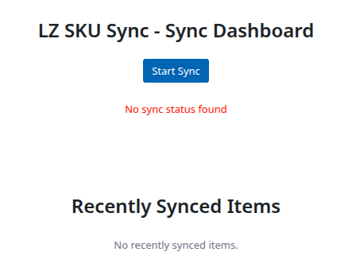
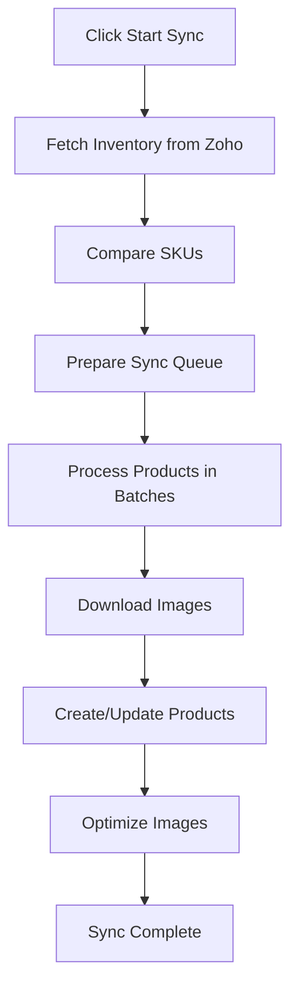
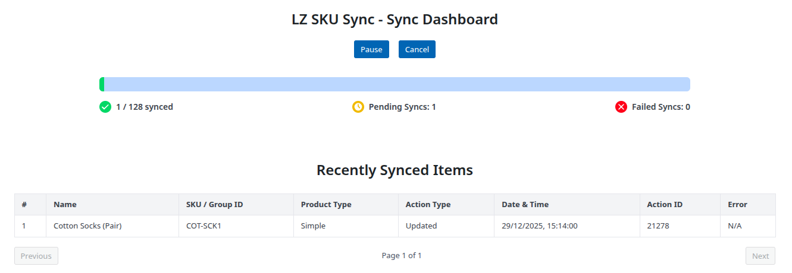
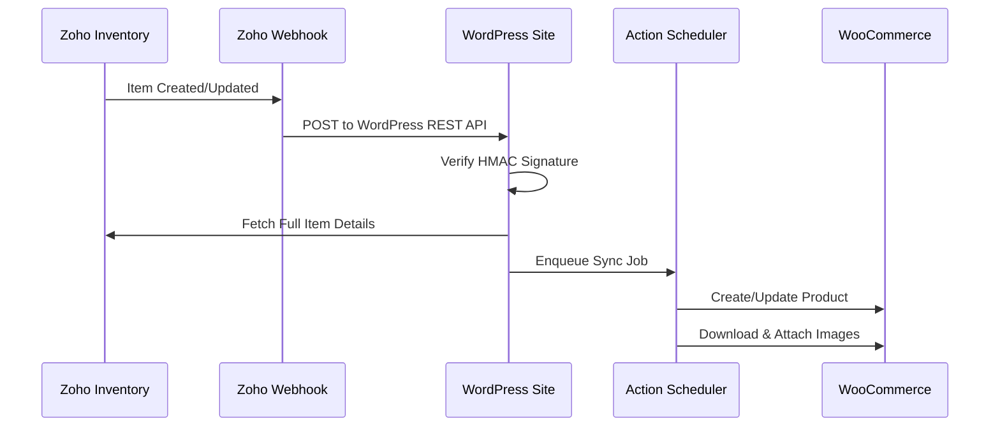

# Synchronization Methods

LZ SKU Sync offers two powerful ways to keep your WooCommerce products synchronized with Zoho Inventory.

---

## Choose Your Sync Method

### Method 1: Manual Sync (One-Time)
Best for initial setup, occasional bulk updates, or when you prefer full control over when synchronization occurs.

### Method 2: Real-Time Webhook Sync (Always)
Best for continuous operations where Zoho Inventory is your primary product management system and you want instant updates in WooCommerce.

---

## Method 1: Manual Sync

### When to Use Manual Sync

- ✅ Initial product import from Zoho to WooCommerce
- ✅ Periodic bulk updates
- ✅ Testing sync settings before enabling webhooks
- ✅ When you prefer to control sync timing

### How Manual Sync Works

1. **Navigate** to **LZ SKU Sync > Sync Status**
2. **Configure** your sync preferences (see Product Settings)
3. **Click** the **Start Sync** button
4. **Monitor** real-time progress
5. **Review** recently synced items as they complete

### Sync Process Flow

### Understanding the Progress

During manual sync, you'll see:

- **Total Products**: Number of products queued for sync
- **Synced**: Successfully processed products
- **Failed**: Products that encountered errors
- **Pending**: Products waiting in queue
- **Progress Bar**: Visual representation of completion

### Sync Controls

#### ⏸️ Pause
- Temporarily stops the synchronization
- Products in queue remain saved
- Click **Resume** to continue from where you left off
- Useful when you need to update settings mid-sync

#### ▶️ Resume
- Continues a paused sync
- Processes remaining products in queue
- No products are re-synced

#### ❌ Cancel
- Stops the sync permanently
- Clears the product queue
- Cannot be resumed (you'll need to start a new sync)
- Already synced products remain in WooCommerce

### Background Processing

Manual sync uses **WordPress Action Scheduler** to process products in the background:

- ✅ Products processed one at a time
- ✅ Prevents timeouts and server overload
- ✅ Continues even if you close the browser
- ✅ Full logging for troubleshooting

!!! tip
    You can check detailed logs at **LZ SKU Sync > Sync Log** in WordPress admin. See the [Sync Log Guide](sync-log.md) for search and filtering features.

---

## Method 2: Real-Time Webhook Sync

### When to Use Webhook Sync

- ✅ Zoho Inventory is your primary product management system
- ✅ You need instant updates in WooCommerce
- ✅ Products are frequently created or updated in Zoho
- ✅ You want a "set and forget" solution

### How Webhook Sync Works

Webhooks provide **real-time synchronization** triggered by changes in Zoho Inventory.

### Enabling Webhook Sync

1. Go to **LZ SKU Sync > Sync Status**
2. Find **Sync Frequency** setting
3. Change from **"One-Time"** to **"Always (Real-time webhook)"**
4. Click **Save Preferences**

### What Happens Automatically

When you enable webhook sync, the plugin:

1. ✅ Creates a webhook in Zoho Inventory
2. ✅ Creates a workflow rule to trigger on item changes
3. ✅ Registers a REST API endpoint in WordPress
4. ✅ Configures HMAC signature verification

!!! note
    You don't need to manually configure anything in Zoho. The plugin handles everything automatically!

### Webhook Status Indicator

The webhook status is shown with a visual indicator:

- 🟢 **Active** (Green): Webhook is receiving updates
- 🔴 **Inactive** (Red): Webhook is paused or disabled

### Toggling Webhook Status

To pause or resume webhook sync:

1. Click the **webhook status indicator**
2. Webhook will toggle between active and inactive
3. When inactive, Zoho events are ignored
4. When active, sync resumes automatically

!!! tip
    Use this to temporarily pause real-time sync without deleting the webhook configuration.

### Security & Validation

Every webhook request is secured with:

- 🔒 **HMAC SHA256 Signature**: Verifies request is from Zoho
- 🔐 **License Validation**: Active license required
- ✅ **Frequency Check**: Only processes if webhooks are enabled

!!! important
    Your license key is used as the HMAC secret. Keep it confidential!

### Monitoring Webhooks

Track webhook activity:

1. Go to **LZ SKU Sync > Sync Status**
2. Scroll to **Webhook Sync Log**
3. Webhook-triggered syncs log shows all the recent webhook syncs
4. Timestamp shows when the webhook was received

You can also check:
- **Last Received**: Timestamp of last successful webhook
- **Webhook Sync Log**: 30-day history of all webhook events

---

## Comparing Sync Methods

| Feature | Manual Sync | Webhook Sync |
|---------|-------------|--------------|
| **Trigger** | Manual button click | Automatic (Zoho changes) |
| **Timing** | On-demand | Real-time (within seconds) |
| **Best For** | Initial setup, bulk updates | Ongoing operations |
| **Control** | Full control over timing | Automated |
| **Batch Size** | All queued products | Single product per event |
| **Pause/Resume** | ✅ Yes | ⚠️ Toggle active/inactive |
| **Requires Setup** | Minimal | One-time enable |
| **API Calls** | Batch (efficient) | Per event |

---

## Combining Both Methods

You can use both sync methods:

1. **Initial Setup**: Run a manual sync to import all existing products
2. **Ongoing**: Enable webhook sync for real-time updates
3. **Periodic**: Run manual sync occasionally to catch any missed items

!!! tip
    **Best Practice**: Start with a manual sync to establish your product catalog, then enable webhooks for continuous updates.

---

## Sync Frequency Recommendations

### High-Volume Stores (100+ SKUs)
- Use webhook sync for real-time updates
- Run manual sync weekly to verify consistency

### Low-Volume Stores (< 100 SKUs)
- Manual sync may be sufficient
- Run sync when making product changes in Zoho

### Seasonal/Event-Based
- Manual sync before major sales or catalog changes
- Enable webhooks during peak seasons

---

## What Gets Synchronized?

Both sync methods sync the same product data based on your [Product Settings](product-settings.md):

- ✅ Product name and description
- ✅ SKU
- ✅ Price (regular price)
- ✅ Stock quantity and status
- ✅ Low stock threshold
- ✅ Weight and dimensions
- ✅ Product images (featured and gallery)
- ✅ Product variations and attributes

---

## Next Steps

Now that you understand both sync methods:

- [**Configure Product Settings →**](product-settings.md) - Customize what data to sync
- [**Learn About Image Management →**](image-management.md) - Understand how images are handled
- [**Set Up Monitoring →**](monitoring.md) - Track sync progress and logs

---

## Troubleshooting

### Manual Sync Stuck

### Webhooks Not Receiving

**Problem:** Changes in Zoho don't appear in WooCommerce

**Solution:**

- Check webhook status indicator (should be green)
- Verify license is active
- Test webhook endpoint: `https://yoursite.com/wp-json/lz-sku-sync/v1/webhook`
- Review webhook logs at **Sync Status > Webhook Sync Log**

### Duplicate Products Created

**Problem:** Webhook creates duplicate instead of updating

**Solution:**

- Verify SKUs match exactly between Zoho and WooCommerce
- Check that "Create Missing Products" is configured correctly
- Review recently synced items for conflict patterns

---

## Support

Questions about sync methods?

- 📧 Email: sales@linkzoho.com, support@krenovate.com
- 📖 [View Troubleshooting Guide](troubleshooting.md)
