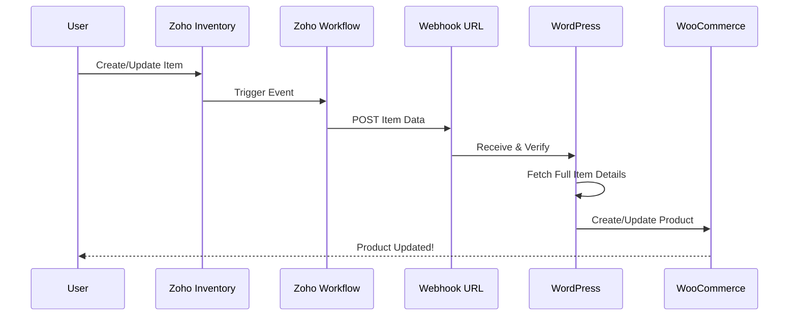

# Webhook Integration

Learn how to set up real-time synchronization using Zoho Inventory webhooks.

---

## What Are Webhooks?

Webhooks enable **real-time, automatic synchronization** from Zoho Inventory to WooCommerce. When you create or update an item in Zoho, the change appears in your store within seconds—no manual sync required.

---

## How Webhooks Work



### The Flow

1. **Event**: Item created or updated in Zoho Inventory
2. **Workflow**: Zoho workflow rule triggers
3. **Webhook POST**: Data sent to WordPress endpoint
4. **Verification**: WordPress verifies HMAC signature
5. **Fetch Details**: Full item data retrieved from Zoho API
6. **Queue Job**: Sync job enqueued in Action Scheduler
7. **Process**: Product created/updated in WooCommerce
8. **Complete**: Change reflected in your store

---

## Automatic Setup

The plugin handles all webhook configuration automatically!

### Enable Webhooks

1. Go to **LZ SKU Sync > Sync Status**
2. Find **Sync Frequency** setting
3. Select **"Always (Real-time webhook)"**
4. Click **Save Preferences**

### What Happens Automatically

When you enable webhook sync, the plugin:

✅ Creates a webhook in Zoho Inventory (`/settings/webhooks`)  
✅ Creates a workflow rule to trigger on item events (`/settings/workflows`)  
✅ Sets workflow to trigger on "Item Add/Edit" events  
✅ Registers WordPress REST API endpoint  
✅ Configures HMAC signature verification  
✅ Saves configuration to database

!!! note
    You don't need to do anything manually in Zoho Inventory. The plugin handles everything through the Zoho API.

---

## Webhook Components

### 1. Zoho Webhook

The webhook URL that receives the POST request:

```
https://yoursite.com/wp-json/lz-sku-sync/v1/webhook
```

**Registered in Zoho:** `/inventory/v1/settings/webhooks`  
**Receives:** POST requests with item data  
**Security:** HMAC SHA256 signature verification

### 2. Zoho Workflow Rule

Automated rule that triggers the webhook:

**Trigger:** Item Created or Item Updated  
**Action:** Send webhook POST  
**Status:** Active (green) or Inactive (red)  
**Registered in Zoho:** `/inventory/v1/settings/workflows`

### 3. WordPress REST Endpoint

The endpoint that processes incoming webhooks:

**Route:** `/wp-json/lz-sku-sync/v1/webhook`  
**Method:** POST  
**Authentication:** HMAC signature + license key  
**Handler:** `Zoho_Inventory_API_Webhook_Receive` class

---

## Security & Validation

Webhooks are secured with multiple layers of protection:

### HMAC Signature Verification

Every webhook request includes a signature header:

```
X-Zoho-Webhook-Signature: {hmac_sha256_hash}
```

**How it works:**
1. Zoho signs the request body using your license key (first 50 characters)
2. WordPress computes the same signature
3. Signatures are compared using timing-safe comparison
4. Request rejected if signatures don't match

```php
// Simplified verification logic
$secret = substr($license_key, 0, 50);
$computed = hash_hmac('sha256', $request_body, $secret);
if (!hash_equals($computed, $received_signature)) {
    return 403 Forbidden;
}
```

### License Validation

- Active license required for webhooks
- Checked before processing every request
- Expired licenses result in 403 Forbidden

### Sync Frequency Check

- Webhooks only processed if enabled in settings
- Prevents processing when user disables webhooks
- Status checked on every request

### WordPress Nonces

- Internal AJAX requests use WordPress nonces
- Prevents CSRF attacks
- Standard WordPress security

---

## Webhook Request Format

### Headers

```http
POST /wp-json/lz-sku-sync/v1/webhook HTTP/1.1
Host: yoursite.com
Content-Type: application/json
X-Zoho-Webhook-Signature: a1b2c3d4e5f6...
```

### Body

```json
{
  "item": {
    "item_id": "1234567890",
    "sku": "PROD-001",
    "name": "Sample Product",
    "rate": 99.99,
    "available_stock": 10,
    "group_id": "",
    "attribute_name1": "Size",
    "attribute_option_name1": "Large",
    "...": "..."
  }
}
```

---

## Webhook Status Management

### Status Indicator

Visual indicator shows webhook status:

- 🟢 **Active** (Green): Receiving and processing webhooks
- 🔴 **Inactive** (Red): Webhooks paused

### Toggle Webhook

To pause/resume without deleting configuration:

1. Click the **webhook status indicator**
2. Status toggles between active/inactive
3. Workflow rule updated in Zoho
4. No data lost - configuration preserved

**Active:**
- Workflow rule set to "active" in Zoho
- Webhook events processed
- Products updated in real-time

**Inactive:**
- Workflow rule set to "inactive" in Zoho
- Webhook events ignored
- Manual sync still works

---

## Monitoring Webhooks

### Recently Synced Items

Webhook-triggered syncs appear in the "Recently Synced Items" table:

- **Action Type**: "Webhook Sync" or specific action
- **Timestamp**: When webhook was received
- **Product Details**: SKU, name, type
- **Action ID**: Link to full logs

### Webhook Sync Log

30-day history of webhook events:

**Includes:**
- Webhook receipt timestamp
- Item data received
- Sync job enqueued ID
- Processing result
- Error details (if any)

Access at **LZ SKU Sync > Sync Status > Webhook Sync Log**

### Last Received Data

View the last webhook payload:

- **Last Received**: Timestamp
- **Last Data**: Full JSON payload
- **Workflow Status**: Current status

Useful for debugging and verification.

---

## Webhook Lifecycle

### Creation (Automatic)

When you enable "Always (Real-time)":

1. Plugin calls `/inventory/v1/settings/webhooks` to create webhook
2. Webhook URL set to your site's endpoint
3. Plugin calls `/inventory/v1/settings/workflows` to create rule
4. Rule configured to trigger on "Item Add/Edit"
5. Rule set to active status
6. IDs saved to database

### Deactivation

When you toggle to inactive:

1. Plugin calls `/inventory/v1/settings/workflows/{id}/inactive`
2. Workflow rule status updated in Zoho
3. Status saved as "inactive" in database
4. Webhook configuration preserved

### Reactivation

When you toggle back to active:

1. Plugin calls `/inventory/v1/settings/workflows/{id}/active`
2. Workflow rule re-enabled in Zoho
3. Status updated to "active" in database
4. Webhooks resume processing

### Deletion

When you deactivate the plugin:

1. Plugin calls `DELETE /inventory/v1/settings/workflows/{id}`
2. Plugin calls `DELETE /inventory/v1/settings/webhooks/{id}`
3. Resources cleaned up in Zoho
4. Configuration removed from database

---

## Troubleshooting Webhooks

### Webhooks Not Receiving

**Problem:** Changes in Zoho don't appear in WooCommerce

**Solutions:**

1. ✅ Verify sync frequency is "Always (Real-time webhook)"
2. ✅ Check webhook status indicator is green (active)
3. ✅ Verify license is active and not expired
4. ✅ Test endpoint manually: `curl -X POST https://yoursite.com/wp-json/lz-sku-sync/v1/webhook`
5. ✅ Check Zoho webhook logs: Zoho Inventory > Settings > Webhooks
6. ✅ Review WordPress error logs for signature failures

### Signature Verification Failures

**Problem:** "Invalid signature" errors in logs

**Solutions:**

- Verify license key is correct and active
- Check that license wasn't recently regenerated
- Ensure no caching on webhook endpoint
- Deactivate and reactivate webhooks to reset

### Delayed Webhook Processing

**Problem:** Changes take minutes to appear

**Solutions:**

- Check Action Scheduler queue size: **LZ SKU Sync > Sync Log** (see [Sync Log Guide](sync-log.md))
- Verify server has sufficient resources
- Review PHP max_execution_time setting
- Check for server-side caching of API responses

### Duplicate Products Created

**Problem:** Webhook creates duplicate instead of updating

**Solutions:**

- Verify SKUs match exactly (case-sensitive)
- Check "Create Missing Products" setting
- Review last webhook data for SKU field
- Ensure product wasn't deleted in WooCommerce

---

## Best Practices

### Initial Setup

1. ✅ Run manual sync first to import all products
2. ✅ Verify products synced correctly
3. ✅ Enable webhook sync for ongoing updates
4. ✅ Monitor first few webhook events

### Ongoing Operations

1. ✅ Keep webhook status active
2. ✅ Monitor "Recently Synced Items" weekly
3. ✅ Review failed webhooks promptly
4. ✅ Maintain active license

### Temporary Pause

To pause without losing configuration:
- Toggle webhook to inactive (don't disable sync frequency)
- Make bulk changes in Zoho
- Toggle back to active
- Run manual sync to catch changes made while inactive

---

## Next Steps

- [**Monitor Webhook Activity →**](monitoring.md) - Track real-time syncs
- [**Troubleshooting Guide →**](troubleshooting.md) - Fix webhook issues
- [**Learn About Security →**](#security--validation) - Understand protection layers

---

## Support

Questions about webhooks?

- 📧 Email: sales@linkzoho.com, support@krenovate.com
- Include webhook logs and last received data when reporting issues
