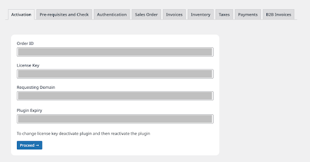

1. Activation screen looks like the below image

2. Enter your order number, you will find this in your dashboard
3. Your license key
4. The requesting domain should be similar to the domain mapped in your LinkZoho dashboard
5. Press activate, if all entries are correct, your plugin will get activated and you will see your plugin expiry date
5. Click on Proceed
